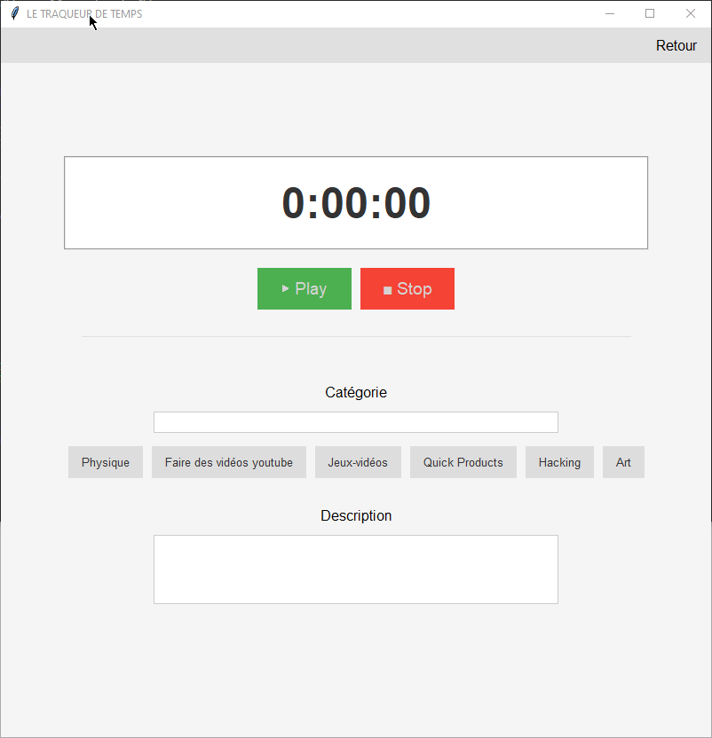
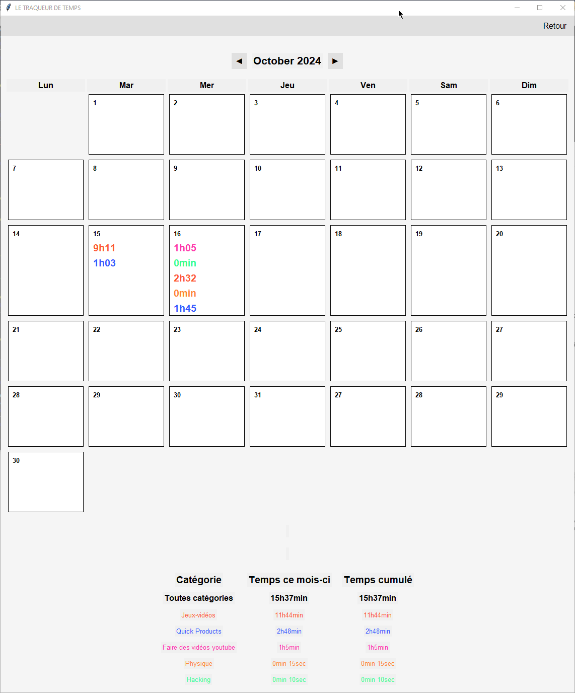

# What is that tool ?
This tool was made for do-ers who are ready to invest time and effort on an higher goal. 
I believe that knowing at a glance the efforts you put on something can really make the difference for achievement. 

- You will be able to see what you did this day and every other day, month and life easily.
- Set your own life objectives and start labeling and tracking time. 

# How does it work ?
You can track your work time and label it.
First you enter a category of work and start the chronometer, and when you are done, you stop it. 

Then you can find your cumulated times for the day.

This is what has the most value to me especially when you choose the right labels and do not split to much.

# What you could do with that ? 
- Decide that you are going to work 100h on your arts skill this month and track it. 
- Decide that you are going to do sport for 30 min per day and track it.
- Get to know where you actually put your time while working.
- Track your time has a freelancer or on a task for work that you bill hourly.

# Install
- Download this has a zip and extract it anywhere you see fit.
- Have python installed.
 - windows :`pip install -r requirements.txt` 
 - mac & linux `pip3 install -r requirements.txt` 

# Compatibility
- Should work on Linux, MacOs and Windows just fine. But only tested it on Windows so far.

# Data
You can configure where the csv log will be for your calendar and it's name in the `Parameters` section.

# It is open source. 
- Do not hesitate to improve on that. Please reference me if you launch a product, that would be much appreciated.

MIT License
Copyright (c) 2024 Quevyn Rohel
